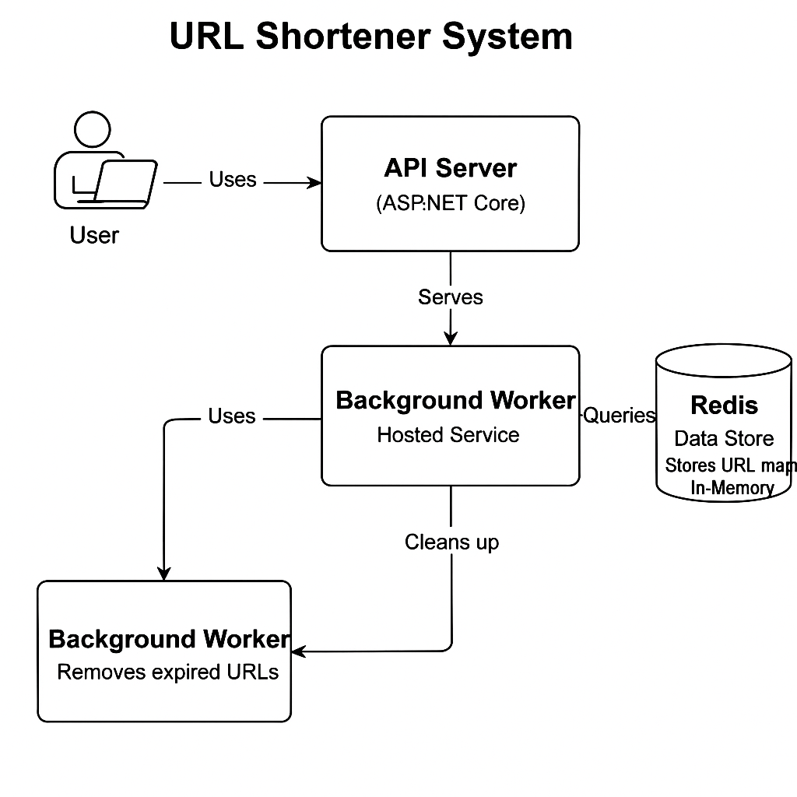

# 🔗 URL Shortener Service

A scalable, containerized URL shortening service built with **.NET 8**, **Redis**, **Blazor WebAssembly**, **Docker**, and **Kubernetes**.


---

## 🚀 Features

- 🔗 Shorten long URLs into compact, shareable links
- 🔁 Redirect users via short URLs
- 🧠 Redis-backed storage for fast lookups with TTL support
- ⚡ High-speed lookup with Redis
- 🐳 Docker-ready deployment
- ✅ Unit tested with xUnit + Moq
- 📄 Swagger API documentation

---

## 🧱 Architecture Overview

- **ASP.NET Core Web API**: Handles shortening and redirection
- **Redis**: Fast key-value store with TTL for URL storage
- **Docker Compose**: Spins up API and Redis containers
- **Optional**: Background Worker for future extensions (e.g., metrics, cleanup)

---

## 📦 Setup Instructions

### 🔧 Prerequisites


### 🧪 Prerequisites

- [.NET 8 SDK](https://dotnet.microsoft.com/download)
- [Docker Desktop](https://www.docker.com/products/docker-desktop/)
- [Minikube (optional)](https://minikube.sigs.k8s.io/docs/start/)
- Git

---

### 🐳 Run with Docker Compose (Recommended)

```bash
docker-compose up --build
```

- API: [http://localhost:5000/swagger](http://localhost:5000/swagger)
- UI: [http://localhost:5002](http://localhost:5002)

---

### ☸️ Deploy on Kubernetes (Minikube)

#### 1. Start Minikube

```bash
minikube start
eval $(minikube docker-env)
```

#### 2. Build images inside Minikube

```bash
docker build -t urlshortener-api:dev .
docker build -t urlshortener-ui:dev -f UrlShortener.UI/Dockerfile ./UrlShortener.UI
```

#### 3. Apply Kubernetes manifests

```bash
kubectl apply -f k8s/
```

#### 4. Access services

```bash
minikube service urlshortener-api-service
minikube service urlshortener-ui-service
```
